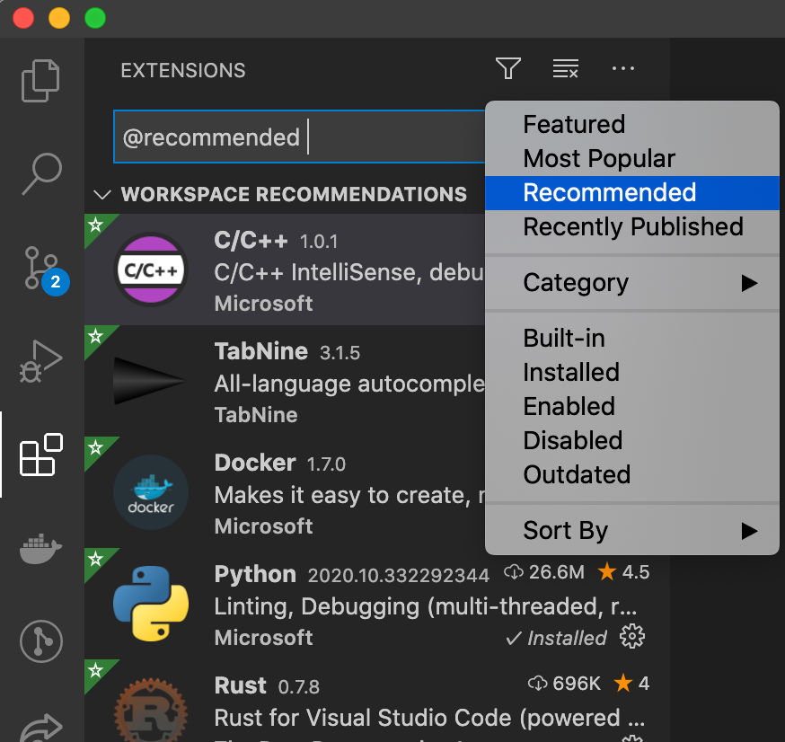

# React Tailwindcss Boilerplate build with Vite

This is a [ReactJS](https://reactjs.org) + [Vite](https://vitejs.dev) boilerplate to be used with [Tailwindcss](https://tailwindcss.com).

## What is inside?

This project uses many tools like:

- [ReactJS](https://reactjs.org)
- [Vite](https://vitejs.dev)
- [TypeScript](https://www.typescriptlang.org)
- [Jest](https://jestjs.io)
- [Testing Library](https://testing-library.com)
- [Tailwindcss](https://tailwindcss.com)
- [Eslint](https://eslint.org)
- [Prettier](https://prettier.io)

## Getting Started

### Install

1. This project use yarn package with *Plug'n'Play*, hence it doesn't require yarn install. For more information, please see [PnP](https://yarnpkg.com/features/pnp)

2. Install the recommended extensions (lint, graphql, typescript for yarn ....)


    

### dev

```bash
yarn dev
```

### Build

```bash
yarn build
```

### Test

```bash
yarn test
```

## License

This project is licensed under the @Humaapi Licence.
